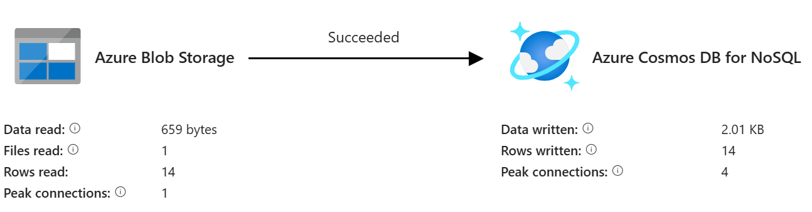

# Blob to CosmosDB

1. Create a pipeline with the name of **pBlob_to_CosmosDB**
2. Drag and drop copy activity
3. configure source as shown below

4. configure target as shown below

5. Debug the pipeline
6. Observe output

7. 
